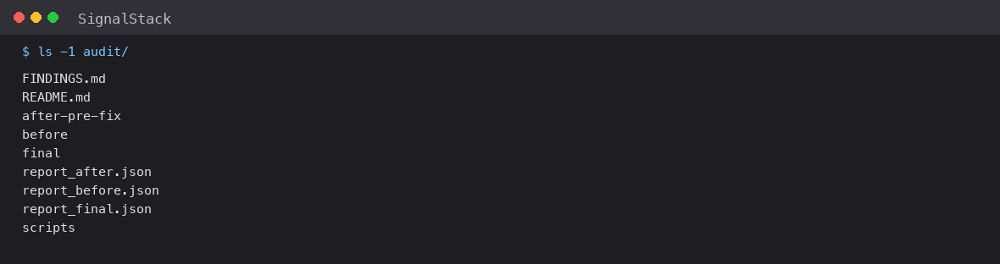

# The one Hindsight audit sweep whose raw reads I didn't keep



Three audit directories hold the raw reads their scores came from: `before/`, `after-pre-fix/`, and `final/`. `audit/after/` is gone, and the only thing left of it is a JSON file of verdicts. I know those reads existed. I know two competitors failed modes D and E under them. I cannot show you a sentence of either, and I cannot re-run the scoring, because the scorer was edited after the sweep and the original is also gone. I published a README number I could never re-derive, and found out how much that mattered when I went back to try.

This is not a story about a bug in the product. The competitive-intelligence agent itself was fine. It's about the failure mode that catches you *after* you've built something good enough to want evidence about — which is the moment your own tooling starts producing numbers that outlive the material they came from.

## What the audit was checking

The system reads a competitor's signal timeline out of [Hindsight](https://github.com/vectorize-io/hindsight) ([docs](https://hindsight.vectorize.io/)) and has a model write a strategic narrative about it. The failure I was hunting was specific and unglamorous: the model writes things the dates contradict. A "30-day cadence" for a timeline whose intervals run 21 to 36 days. A cycle that "repeats three times" for a transition that occurred once. A confident forecast for a competitor whose last signal was 40 days ago.

So I wrote a five-mode scorer. Mode `A` catches overclaimed repetition — prose that says "repeats" when the transition count says otherwise. Mode `B` catches ignored staleness. Mode `C` catches a prediction that contradicts the latest trend. Mode `D` catches missing calibration — a confident read with no confidence field, or a confidence that isn't grounded in the evidence. Mode `E` catches arithmetic and date errors, which is where a fabricated cadence lives.

The scorer is real code and it's still in the repo, in `audit/scripts/check.py`. Each mode returns a verdict and a list of notes, and the notes name the exact offending span so a human can go look. That part worked, and for the sweeps I still have the evidence for, it worked well: the pre-fix reads in `before/` are preserved verbatim, and the current scripts score them at `0 / 0 / 0 / 10 / 0`.

Which brings us to the ten.

## The discrepancy that started this

Here is `report_before.json`, scored by the current harness, in full:

```json
{
  "Brightline Retail": { "res": {
      "A": {"verdict": "PASS", "notes": []},
      "B": {"verdict": "PASS", "notes": []},
      "C": {"verdict": "PASS", "notes": []},
      "D": {"verdict": "FAIL", "notes": ["NO CONFIDENCE LABEL", "NO \"what evi..."]},
      ... } }
}
```

All ten competitors fail mode `D`, and every one of them fails it for the same reason: `NO CONFIDENCE LABEL`. Look at the actual field being read and the problem is obvious. Those reads predate the `confidence` field entirely — the system didn't have one when they were generated. The harness is correctly reporting what it found: there is no confidence label.

But the number I put in the README was seven, not ten, and the two figures are easy to confuse, so let me separate them. The baseline `3 / 2 / 1 / 7 / 6` is five numbers — the failure counts for modes A, B, C, D and E respectively, produced by the *original* harness. Seven is just its D-mode component. The `10` is something different: it's mode D failing on all ten reads when the *current* harness scores the same preserved directory. Same ten reads, same missing field, two different instruments.

That is the whole problem: **the difference between the number I published and the one I can reproduce lives entirely in the scorer, and the scorer is what changed.** The reads are stable; the instrument was revised. Nothing records what the original did, so there's no way to recover the seven.

I left the honest version in the README rather than quietly reconciling the numbers:

> Treat this table as a record of what was observed at the time, not as a reproducible measurement.

That's a sentence I added *because* I finally went back and tried to re-derive the number and couldn't. It is also the most useful sentence in the audit section, and it was the last one I was willing to write.

## The sweep with no evidence at all

`report_after.json` is worse. It scores an intermediate sweep at `0 / 0 / 0 / 3 / 2` — three competitors failing mode `D`, two of them also failing `E` — and the Lumen Health entry still carries the full read inline:

```json
{"Lumen Health": {"verdicts": {"A": "PASS", "B": "PASS", "C": "PASS",
  "D": "FAIL", "E": "FAIL"}, "notes": {"D": ["..."], "E": ["..."]},
  "read": {"competitor": "Lumen Health", "patterns": "..."}}}
```

You can see it: a `read` object, the actual model output, sitting right there in the report. Which makes it worse, because it means the harness *could* have preserved everything and I chose to write only the summary. The raw reads went to `/tmp/audit/after/`, and `/tmp` is not a place I archive things. `audit/` has `before/`, `after-pre-fix/`, and `final/`. There is no `after/`, and there never will be again.

So the final table in the README cites a `0 / 0 / 0 / 0 / 0` result that I can reproduce from `final/`, and separately cites a `3 / 2 / 1 / 7 / 6` baseline that I cannot reproduce from anything. Both numbers are in the same table. One is measurement, one is testimony, and nothing in the file format distinguishes them.

## The scripts that prove I never moved them

You would think someone would have tidied the paths. Nobody did, deliberately, and the reason is instructive. Open any of the audit scripts:

```python
S=json.load(open('/Users/rishithal/Documents/SignalStack/data/seed_signals.json'))
    d=json.load(open(f'/tmp/audit/after/{slug}.json'))
```

Absolute paths. My home directory. A scratch directory. Both lines are verbatim from `audit/scripts/audit_after.py`, username and all; the three audit scripts differ only in which of `before/`, `after/`, or `final/` they read. These scripts don't run from a fresh clone, and the README says so. The reasoning is that editing them to be portable would mean the code in the audit folder no longer matches the code that produced the audit, and an audit you can only run by trusting the current author is not evidence. So I left the warts in, and documented them instead.

I think that instinct was right, and I also think it's the reason the two problems above were invisible for so long. A folder full of paths that obviously do not work is a folder everyone assumes is already broken. The missing directory and the revised scorer look like more of the same. The preserves-nothing-forever failure was hiding in plain sight in a folder that everyone had already agreed was unfinished.

## What I'd do differently

The fix is unglamorous and I want to be clear that I did not do it retroactively, because doing it now would be falsifying the evidence:

**Never let the instrument and the observation live in the same lifetime.** The read is the irreplaceable artifact. The scorer is software, and software changes. I archived the reads when I thought about it and not when it mattered, because the sweep that lost its data was the one I thought was throwaway — an intermediate state on the way to the final. The intermediate states are the ones you skip, and the intermediate state is the one you end up quoting in a table.

**Score into a format that carries its own provenance.** `report_after.json` and `report_final.json` have a different shape — `verdicts`/`notes`/`read` versus `res` — and they came from different harness versions. A record that included the harness version, the timestamp, and a checksum of the scorer would have made the `3/2/1/7/6` problem a five-second check instead of a discovery.

**Write the summary and the evidence in one atomic step.** There is no reason a report and its inputs are ever separate files. The harness should have written the reads into the same directory as the report, with the report as an index over them. Then "I lost the directory" is not a thing that can happen.

The broader lesson, and the one I'd actually carry: **an audit that you cannot re-run is a story, not a measurement, and you owe your readers the difference.** [What agent memory is and why it is hard](https://vectorize.io/what-is-agent-memory) is worth reading if you're building anything on a memory substrate, but the part that cost me was not Hindsight. It was me treating a number as a property of the system when it was actually a property of the system *plus a version of my own tooling that I no longer have.*

The scoring harness is unchanged and still runs, and the final result reproduces from preserved reads. The offline suite that guards the product itself — 522 checks — is a different mechanism entirely, and it works precisely because it's not evidence of anything except the current code. If you take one thing from this: an audit that proves today's code behaves correctly and an audit that proves what happened earlier in the project are different instruments with different obligations, and only one of them is allowed to change.
