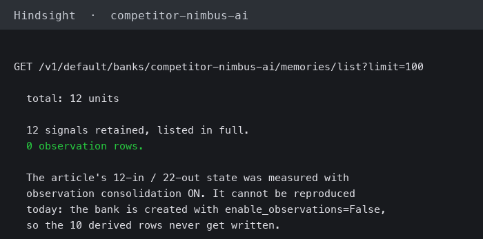
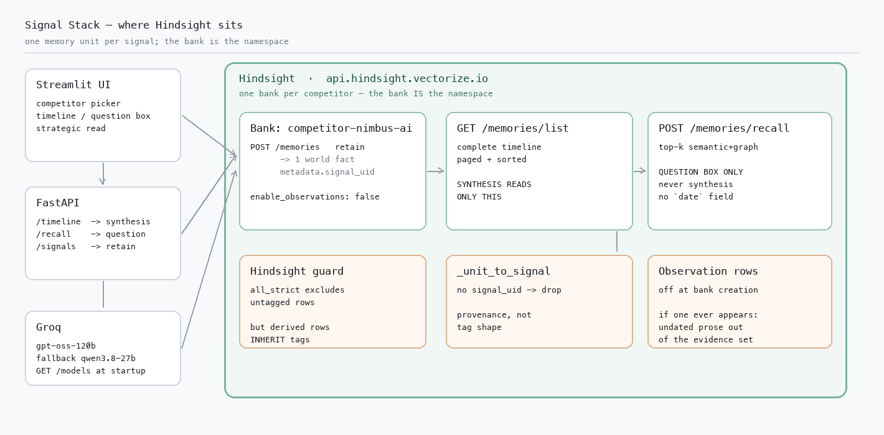
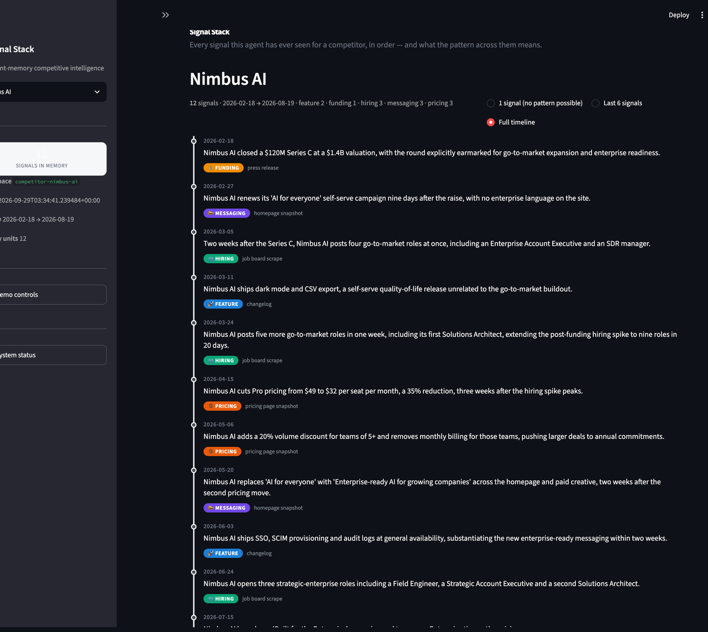
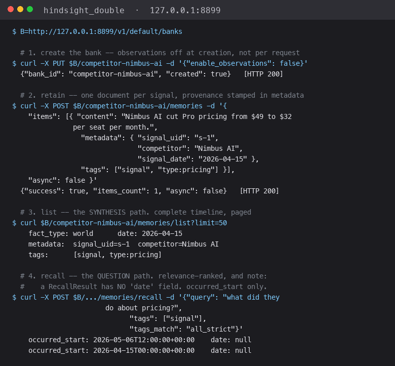

# I turned off Hindsight observations after reading 22 units back



I logged twelve signals for one competitor, listed its bank, and got twenty-two units back. Twelve in, twenty-two out: Hindsight had written ten narrative rows of its own — `observation` facts summarising patterns across the documents I'd just retained. I'd asked for a timeline. I got a timeline plus a first draft of the analysis the timeline existed to support, from a layer I hadn't enabled. I turned observations off at bank creation and the ten rows never appeared again.

That is the whole incident. The rest is the three design decisions behind it, which are really one decision: **use the memory store as storage, not as a second opinion.**

## The shape of the system



Signal Stack tracks competitors. Each one gets its own [Hindsight](https://github.com/vectorize-io/hindsight) bank ([docs](https://hindsight.vectorize.io/)) — `competitor-nimbus-ai`, `competitor-vertex-cloud` — and a bank *is* the namespace. No tagging scheme to keep competitors apart, no cross-tenant filter to get wrong, and `GET /banks` is the competitor list for free, so there's no second source of truth to drift. If two competitors' memories can interleave, the timeline is wrong, and a wrong timeline produces confident nonsense downstream.

Each signal is one `POST /memories`. A strategic read then does a `GET /memories/list`, pages the whole result, and sorts by date itself. The model gets the complete ordered history and writes intent. Two Hindsight capabilities stayed out of the synthesis path on purpose. The one that bit me first was observations.



## The ten rows I didn't ask for

Hindsight does more than store documents. Given a bank, it extracts typed facts and — with observation consolidation enabled — derives `observation` rows summarising how documents relate. The bank config takes a flag:

```python
self._request(
    "PUT",
    f"{API_PREFIX}/{bank_id}",
    json_body={
        "retain_mission": RETAIN_MISSION,
        # We store discrete, dated, typed signals and do our own
        # cross-signal reasoning in synthesis.py. Hindsight's
        # observation consolidation would additionally write
        # narrative rows ("Nimbus's messaging strategy has shifted
        # from X to Y") that duplicate our synthesis step while
        # competing with it for the reader's attention. Verified on
        # the real API: 12 retained signals produced 12 `world`
        # facts plus 10 derived `observation` rows — double the
        # stored units, none of which we asked for.
        "enable_observations": False,
    },
)
```

The comment is the finding, and it's longer than the code. The problem isn't duplication. It's *provenance*. Those ten rows are prose. They have no date. And undated prose sitting on a timeline is exactly the material from which you cannot falsify a prediction — if your evidence says "Nimbus's messaging strategy has shifted," and your forecast says "Nimbus will announce pricing next," a reader cannot check the first claim against anything, because there is no `2026-04-08` attached to it. Hindsight's own summary of a pattern is the most authoritative-looking, least checkable input you can hand a model.

So: off by default, and I mean the *product* default, set at bank creation rather than in my client's request, so it holds however the data arrives.

## The guard that has to be two deep

Turning the flag off is necessary and not sufficient, and this is the part I'd argue hardest about in a review. Hindsight's derived observations **inherit the `tags` of the source fact they were derived from.** They pass a tag filter. They are not our signals, and no tag-based scope will exclude them.

The scope I need is "only our own signals," and I got there two ways. The first is `tags_match`:

```python
if tags:
    params["tags"] = tags
    params["tags_match"] = "all_strict"
```

`all_strict` is load-bearing, because the default is a trap. Hindsight's default is `any`, which is an OR — and it **also includes untagged rows**. So the intuitive code, filter on `tags=["signal"]` and inherit the default, returns every untagged unit in the bank too. It looks like it worked. It returned a superset. I found this reading the enum in the OpenAPI spec — `any|all|any_strict|all_strict|exact` — and noticing that two of those five are "strict" precisely because the others surprise you.

The second guard is the one that does the work, because derived rows inherit tags:

```python
@staticmethod
def _unit_to_signal(unit: dict, competitor: str) -> Signal | None:
    metadata = unit.get("metadata") or {}
    if not metadata.get("signal_uid"):
        return None  # a fact Hindsight derived that is not one of our signals
    try:
        return Signal(
            competitor=metadata.get("competitor") or competitor,
            date=metadata.get("signal_date") or unit.get("date") or "",
            ...
        )
    except Exception:  # a malformed row must not break the whole timeline
        return None
```

We stamp a `signal_uid` into every signal's metadata when we write it. Anything Hindsight derived has no `signal_uid`, so it isn't a signal, and it comes off the timeline. That guard is independent of tagging, of consolidation settings, and of anything Hindsight does in a future version — it doesn't ask whether a row *looks* like one of ours, it asks whether we can prove it is. The `except` is deliberate too: one malformed unit must not take down the timeline, and dropping a row I can't parse is the right direction to fail.

Two independent guards, because I measured the behaviour and the tag scope alone demonstrably does not hold.

## `reflect`: the one I argued for keeping

Hindsight has `reflect`, its own synthesis pass over a bank. It would have solved my problem outright — ask it what the pattern is, print the result, done. I didn't use it, and the reason is about reproducibility rather than quality.

`reflect` produces a narrative. My synthesis also produces a narrative, from the same bank. If I call both, there are two models' answers to the same question and no rule for which one wins — so the output is a coin flip, and worse, a coin flip I can't reason about when it lands wrong. Keeping synthesis in one place means the grounding rules, the confidence contract, and the validators all apply to exactly one code path. Same timeline, same prompt, one output. The system is either correct or it isn't, and when it isn't, I can find out why.

There is a real cost: `reflect` is a more capable model call than mine and I've left performance on the table. I made the trade because a read that says one thing on Tuesday and something different on Wednesday for no reason I can point at isn't a product.

## `recall`: the one I kept, narrowly



`recall` is relevance-ranked semantic search. It answers "what is similar to this?", which is the wrong question for pattern detection — pattern detection needs "what happened, in order, on which date?" A top-k slice will cheerfully drop the signal that never repeated, and the signal that never repeated is often the one the forecast depends on. Worse, a prediction computed over a partial timeline isn't a weaker prediction, it's a *differently-shaped* one, and the difference is invisible to the reader. If I can't explain why the evidence for a claim is missing, I shouldn't be making the claim.

So `recall` is not in the synthesis path at all. It gets its own route, its own UI box, and its own label — "the k most relevant signals," not "the timeline" — because the moment you present a similarity slice as if it were the history, you've reintroduced exactly the bias you removed.

But refusing to use a capability entirely would be its own dogmatism. "What do I know about their audit logging?" is a real question and relevance-ranked search is the right tool for it; in that case missing the rest of the timeline isn't a correctness problem, it's the point. So the question box really does call Hindsight's recall, honestly labelled. The rule I landed on: **a feature is allowed to use the biased read if it labels the bias.** The strategic read can't, and the question box can.

The cost sits on the synthesis side. The strategic read never asks Hindsight a question, so it gets no graph search. It pages the full history and reasons over it. That is the price of a forecast whose evidence is the complete timeline, and the README says so.

## The generalisable bit

If you're building on a memory substrate, [agent memory's own documentation](https://vectorize.io/what-is-agent-memory) frames what the store is for. What I had to work out for myself is which of its behaviours you can safely let near a claim.

The three that bit or nearly bit me, in order of damage:

**A default that silently returns a superset.** `tags_match: any` includes untagged rows. Your filter looks like it works and it's the opposite of narrow. Read the enum, find the `strict` variants, use them.

**Derived rows inheriting their source's tags.** The one that makes a filter insufficient. A tag scope cannot exclude a row that carries the tag. You need a provenance check — a stamp you wrote, verified on read — *in addition to* the filter, not instead of it.

**A layer's own summarisation sitting in your evidence.** Not because the summaries are wrong, but because they're undated. The moment undated prose enters an evidence set, the set stops being checkable, and an unfalsifiable forecast is worse than no forecast because it reads as an insight.

The general form: **a memory store is a good place to keep typed, dated, owned facts, and a dangerous place to keep derived prose if anything downstream will make claims from it.** Store it there, keep it out of the analysis, and verify provenance on the way back out — twice, because one mechanism is a bet and two is a guard.
