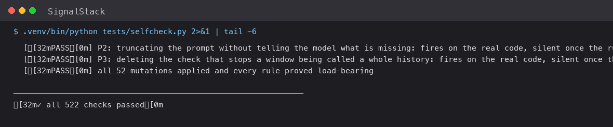
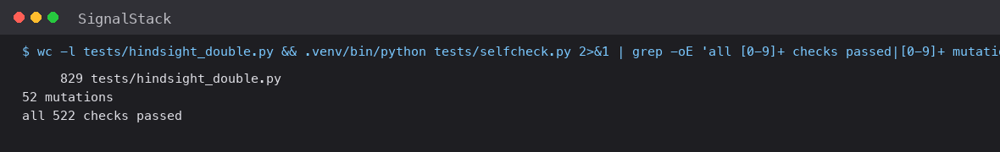

# My Hindsight validator passed with its own rule deleted



Here's the check that changed how I write tests. It's a mutation: it takes a rule out of the source, runs the test that supposedly covers that rule, and fails the whole suite if the test still passes. I run 52 of them. A validator that rejects a fabricated 30-day cadence, I delete, and then I demonstrate that the test I wrote for it stops rejecting it. Every time. The point is not to prove the code is correct — that's what the test is for. The point is to prove the *test* is doing the work, which is a different claim and one I'd never actually verified before I had a way to break it.

The mutation harness turned out to be the second piece of my test infrastructure to lie to me. The first was a mock.

## First, the mock I should never have written

Signal Stack reads a competitor's signal history from [Hindsight](https://github.com/vectorize-io/hindsight) ([docs](https://hindsight.vectorize.io/)) and asks a model for a strategic read. To test that without spending money or writing to a real account, the obvious move is a fake Hindsight.

The obvious fake is a lie. You write `get_timeline` to return whatever your test needs — four signals here, eleven there — and the suite goes green in an afternoon, having proved nothing about the client. It proves your code does what your code does when handed data you constructed to match your code. The failure mode is invisible because the fake and the real thing share only their function signatures, and signatures are exactly the part that isn't interesting.



The 829-line double in `tests/hindsight_double.py` is built from Hindsight's published OpenAPI instead — [agent memory](https://vectorize.io/what-is-agent-memory) is worth reading for the wider picture — fetched from the spec, transcribed, and enforcing the real API's rules, including the ones that inconvenience me:

```python
  BankListResponse         {banks:[BankListItem], total, limit, offset}   (all required)
  RecallRequest            {query (required in practice; plain str, no
                             declared minLength), types, prefer_observations,
                             budget: low|mid|high = mid, max_tokens, trace,
                             query_timestamp, include, tags, tag_groups,
                             min_scores, temporal_window,
                             tags_match: any|all|any_strict|all_strict|exact = any}
  RecallResult             id (REQUIRED), text (REQUIRED), type, entities,
                             context, occurred_start, occurred_end, mentioned_at,
                             document_id, metadata (str->str), chunk_id, tags,
                             source_fact_ids, scores, attachments
                             -- NOTE: there is NO `date` field on a recall
                             result. The date is occurred_start/mentioned_at.
```

That third block is a bug I found in my own client by writing the double. I was reading `result.date`. There is no `date` on a `RecallResult` — it's `occurred_start` or `mentioned_at` — so my field was always `None` and recall results were being silently dropped. Every test against the fake passed, because the fake had invented the field. A mock is where your misunderstandings go to hide.

The double also implements the five real `tags_match` semantics, rejects unknown bank-config fields with a 422, paginates and sorts the bank listing, 404s on a missing bank, and seeds every bank with untagged derived `observation` rows — including one carrying an inherited `signal_uid`, because that's the realistic consolidation case and it's what breaks clients which trust their own tag filter. A fake would never have contained that row, because a fake only holds the cases you already know about.

A client that's wrong about Hindsight now fails in the suite, in a second, for free. It doesn't fail in production, on a call whose logs I can't read, in front of someone.

## Proving the test is not decorative

522 checks passing is a sentence with no content until you ask *what would have to be true for this suite to be worthless*. The honest answer was: a rule could be deleted, the test could keep passing, and nothing would ever notice. That's not hypothetical — it's the standard failure mode of assertion-light testing, and I'd written a lot of "expected value equals what I put in" checks.

So the suite has a section that goes the other way. Each mutation clones the module, applies a text replacement to the source, and asserts the corresponding test *fails*:

```python
_mutates(
    "D2: deleting the signal floor",
    lambda: _stack(facts_mod=_mutant_from(
        "backend.facts",
        replacements=[("MIN_SIGNALS_FOR_EVIDENCE = 5",
                       "MIN_SIGNALS_FOR_EVIDENCE = 0  # MUTANT")])),
    lambda m: not m["F"](_seed["Vertex Cloud"]).evidence_sufficient,
)
_mutates(
    "D2: deleting the dispersion guard",
    lambda: _stack(facts_mod=_mutant_from(
        "backend.facts",
        replacements=[("MAX_INTERVAL_SPREAD = 3",
                       "MAX_INTERVAL_SPREAD = 10000  # MUTANT")])),
    lambda m: not m["F"](_erratic).evidence_sufficient,
)
```

Read the third argument as the *negation of the test's assertion*: a competitor that must be refused, after the rule is deleted, is no longer refused — so the guard is load-bearing, so the test is real. If deleting `MIN_SIGNALS_FOR_EVIDENCE = 5` still produced a refusal for Vertex Cloud, both the constant and its test were decoration.

There are 52. Seven re-introduce defects a real audit of ten live competitors caught — a refusal allowed to report the wrong confidence values, the retry notice asking the wrong end of the contract, a digits-only interval pattern. Those are the ones I'd otherwise quietly refactor away, pinned to a specific historical failure and looking over-specified until you remember which one you're fixing.

Mutation testing is unfashionable because it's expensive and it finds things you already half-suspected. Both were true. It's still the difference between "the suite is green" and "the suite is green and would be red if I broke the thing it claims to cover."

## The harness that can lie to me

The mutations work by text replacement on the source. `_mutant_from("backend.facts", replacements=[("MIN_SIGNALS_FOR_EVIDENCE = 5", "MIN_SIGNALS_FOR_EVIDENCE = 0  # MUTANT")])` finds that exact string, replaces it, and imports the result. If the string isn't there — because I renamed the constant, reformatted it, or moved it — the replacement silently does nothing. The clone loads, it's the *unmodified* module, the test I expect to fail passes, and the mutation reports success.

That is a green check that asserts nothing, in a section whose entire purpose is to assert that checks aren't green when they shouldn't be. I found it because the harness has a floor on how many mutations must apply:

```python
check(f"all {_runs[0]} mutations applied and every rule proved load-bearing",
      _runs[0] >= 20, f"only {_runs[0]} mutations ran")
```

The count assertion catches the catastrophic version — renumber every constant and the suite notices. It does not catch the surgical version: rename one constant, that one mutation no-ops, the other 51 still run, the count is fine, and the guarantee for that specific rule is gone with nothing to show for it. The mutation label still says what it claims to have removed.

I have not fixed this properly, and I'd rather say so than ship a fix I can't defend. The real fix is to assert that each clone actually differs from its parent — `assert mutated_source != original_source` — which is two lines and would have caught it. I haven't added it because the moment you assert "the mutant differs," you also need to decide what to do when a legitimate no-op mutation is intentional, and I haven't thought that through. So today the guarantee is: the count is right, and any individual mutation is a claim I'm trusting. If I were serious about it, the per-mutation diff check is the first thing I'd add, and the reasoning above is the reason I didn't do it blind.

The thing I want to keep from this is not "my harness is buggy." It's the shape of it. A harness that verifies test coverage is itself test infrastructure, and it inherits every property of the thing it verifies: it can be wrong, it can be stale, and it will happily report success while doing nothing. Nobody writes a test for their test runner. Everybody should.

## The isolation check I like most

One test does something worth calling out, because it's a test whose *pass* is the evidence and whose failure is just a bug. The suite exercises the destructive paths — delete a bank, reset everything, clear memory — and those hit a real Hindsight API. So the test deletes banks named `competitor-alpha` and `competitor-beta` on a dedicated double bound to loopback:

```python
# deletes banks named competitor-alpha / competitor-beta on a dedicated
# double — names that cannot exist in any real account, so a passing
# delete is itself proof the test never left loopback.
```

No environment check. No "are we in test mode?" guard that can be set wrong. The bank names are impossible in production, so if the delete succeeds, the test *could not have been talking to production*. The property under test and the safety property are the same assertion.

The general lesson: **a safety guard that lives in configuration is a guard you have to remember to set.** A safety property that lives in the test data is one you can't forget, because forgetting it makes the test fail rather than silently succeed.

## What I'd tell my past self

**Write the fake from the spec, not from your client.** Every field I invented, I invented from an assumption, and every one was wrong. A spec-derived double turns those into loud failures instead of silent ones — more work up front, and it finds bugs in the first hour.

**A passing test is a claim about a test, not about your code.** "This test covers this rule" is only supported by breaking the rule. Fifty-two mutations is not paranoia; it's the minimum evidence for fifty-two rules. And apply the same standard to the mutation harness — a verifier that can silently verify nothing is worse than none, because it manufactures a guarantee you didn't earn.

**Make safety properties structural, not conditional.** "This test can't touch production because of an env var" is a promise. "Because the bank name doesn't exist in production" is a guarantee, and it can't be forgotten because forgetting it breaks the suite.
