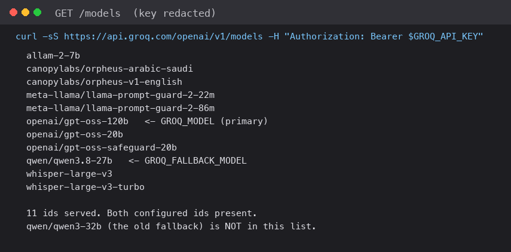

# A 429 Wasn't a Bad Model ID: Deploying My Hindsight Agent



Two different failures wore the same costume, and the one I noticed second was the one I nearly misdiagnosed. There *was* a genuinely bad model id in this project, and I had already fixed it: `qwen/qwen3-32b` isn't served on my account, so asking for it returns 400. The fallback is now `qwen/qwen3.8-27b`, and `backend/config.py` carries a comment about it so the next person doesn't "fix" it back. Then, later, a 429 arrived, and I read it as the same problem — evidence that the id I'd just changed to was wrong too. It wasn't. I re-ran `GET /models` against the same account: it serves 11 ids, including both configured ones.

"Rate limited" and "no such model" are different failures with different fixes, and they both come back on the same connection, so conflating them sent me re-checking a configuration that had been correct the whole time. The service now checks its own model ids at startup and tells you by name which of the two you are in.

That's the small lesson. The larger one is what it takes to move a working local app somewhere the public can reach it, and how little of that work touches the app.

## The two services

Signal Stack reads competitor signal histories from [Hindsight](https://github.com/vectorize-io/hindsight) ([docs](https://hindsight.vectorize.io/)) and serves a strategic read. Locally it was one process behind one port: FastAPI on `127.0.0.1:8000`, Streamlit on `8501`, over loopback. Deployed, it became two Render services with a hostname in between, and every assumption encoding "same machine" quietly became false.

The blueprint says what had to change and, more usefully, why:

```yaml
#   1. The API must bind 0.0.0.0, not loopback. Render routes only to the
#      service's published PORT, so binding 127.0.0.1 would be unreachable
#      from outside even though the process is healthy.
#   2. The frontend needs BACKEND_URL pointing at the backend's public URL.
#      It is not set here because the hostname is only known after the backend
#      is created.
#  [... elided ...]
services:
  - type: web
    name: signalstack-backend
    startCommand: "python -m uvicorn backend.main:app --host 0.0.0.0 --port $PORT"
    healthCheckPath: /health
  - type: web
    name: signalstack-frontend
    startCommand: streamlit run frontend/app.py --server.port $PORT --server.address 0.0.0.0
```

That first consequence would have bitten me silently. Binding loopback is the *right* default for a local app and I kept it — `API_HOST` is `127.0.0.1` unless the environment says otherwise — because a public API writing to your Hindsight account shouldn't listen on every interface just because someone deployed it. But it means the same unmodified code is healthy and unreachable on Render: health check passes, process running, nobody can connect. The config default and the platform requirement are in direct conflict, and the platform wins.

The second consequence is a dependency the file can't express. The frontend needs the backend's URL, and the backend's URL doesn't exist until the backend is deployed. So it's `sync: false`, filled in from the dashboard after the first deploy, and `DEPLOYMENT.md` exists mostly to give you that order. No elegant fix exists: deploy the backend, copy the hostname, set it, redeploy the frontend.

One more, which cost me a slow first load. Render's free tier spins down after ~15 minutes idle, so the first request after a pause pays for a cold start: 32 seconds cold, 0.8 warm. `/health` isn't what stalls — it only reads local config. What blocks the boot is the startup event, where a read-only `GET /models` probe runs. And the frontend's 180-second timeout does nothing: Render's edge gives up on the origin first and returns its own 502 — a fast failure, long before the client stops waiting.

## Distinguishing the two failures

The client was already doing the right thing about rate limits — honouring the server's wait rather than sleeping a made-up interval — and the code is small and worth reading because most of it refuses to be clever:

```python
def _retry_after_seconds(response: Any) -> Optional[float]:
    """Pull the server's own wait hint out of a 429, if it sent one."""
    headers = getattr(response, "headers", None) or {}
    # Retry-After is either delta-seconds or an HTTP-date. Only the numeric
    # form is worth parsing; a date would need a clock we should not trust
    # against the server's.
    raw = headers.get("retry-after") or headers.get("Retry-After")
    if raw:
        try:
            return max(0.0, float(str(raw).strip()))
        except (TypeError, ValueError):
            pass
    # Groq's JSON error message embeds it: "Please try again in 34.98s."
    match = re.search(r"try again in\s*([0-9]+(?:\.[0-9]+)?)\s*s", body, re.I)
```

Two wait hints, and a deliberate refusal to parse the HTTP-date form, because comparing it to our clock introduces an error we don't need. The audit log records the cost: nine HTTP 429s across the live run, each honoured with the server's own wait between 4 and 30 seconds, none exhausting its retries. No read was lost to rate limiting.

And yet I read those 429s as a config error, because that's what a 429 *feels* like when you've just been burned by one. So:

```python
def verify_configured_models() -> list[str]:
    """Check GROQ_MODEL and GROQ_FALLBACK_MODEL against this account.

    Returns human-readable problems, empty when the configuration is servable.
    Called once at startup, and deliberately returns findings rather than
    logging or raising: the caller decides the level, and the suite asserts on
    the text.

    Model availability is per-account and per-plan. A model id that is valid
    everywhere else 400s here, and the failure surfaces as a confusing
    extraction error on the first signal rather than as "that model does not
    exist on your plan" -- which is the message an operator can act on.
    """
```

That's the lesson. **Model availability is per-account and per-plan.** An id that is correct elsewhere can 400 on yours, and the failure doesn't look like a 400 — it looks like a broken extractor, because the extractor is where it surfaces. One `GET /models` at startup turns a guessing game into a named warning. It returns findings rather than logging or raising, so the caller decides severity and the test can assert on the text.

The general form: **an ambiguous provider error should be disambiguated by asking a question the provider can answer cheaply, early, in a message an operator can act on.** I'd already paid for the bad-id half once, which is exactly why the 429 half fooled me. A recent, vivid example of failure X makes unrelated failure Y look like X.

## The bugs the real account found

This is the part an offline suite can't derive, and the reason the deploy was worth doing. Both bugs surfaced in the last stretch of live verification, and neither is exotic.

The first is a Streamlit rule I violated in the obvious way. After the app writes a signal it must clear the text box. I assigned the widget's `session_state` key directly, below the widget's own declaration, and every rerun raised. Streamlit forbids assigning a widget key once that widget exists in the run — not only on the causing click, but on every rerun reaching the line, so the page is dead until you restart the session. The fix defers: set a flag at the bottom, consume it at the top of the next run. Two flags, one `st.rerun()`, and the comment I left is longer than the fix.

The second was dumber. I stored a three-element tuple carrying the before/after pair *and* the id of the signal producing the after-read, so a second log couldn't diff against a read taken before the first — then unpacked it as a two-tuple. The attribution guard sat below the crashing line, so it never got the chance to be right. It surfaced only because the seed data sits at the threshold where the diff path runs: four signals, one short of the floor, so a read refuses and the comparison against that refused read is the first thing that executes.

Both were found by clicking the real UI against the real account. Neither is reachable from the offline suite, which isn't a browser.

## The mistake I'm least proud of

Which brings me to the one I did to myself: I reset the real Hindsight account twice in one session.

`scripts/seed_data.py --reset --verify` deletes every competitor's bank and reloads the dataset. I piped its output to `head`, which closed the pipe, which killed the process, which in my shell re-ran the command. Destructive script, piped, twice, on the account I cared about. The data was restorable — the whole design of a seeded dataset — so nothing was permanently lost, and I'd asked permission once already. But "I piped a destructive command and the shell ran it again" is a sentence I had to say out loud to a person, and the fix was one redirection to a file.

Which is the deployment version of the 429 story, if I'm honest. Both have the same shape: a thing behaved in a way I didn't anticipate, I explained it with the theory I already had, and the right response was to go get evidence from the source rather than reason harder about a guess. For the 429 that evidence was `GET /models`. For the reset it was reading my own command line.

## What I'd tell someone deploying this

**Split only when you can name the cost of not splitting, and write it down.** Two services means a hostname you can't know in advance, a health check crossing a network boundary, and two cold starts. The blueprint comments are where I made that honest.

**Keep the safe default and override it in the deployment, not the reverse.** Loopback binding, `AUTOSEED=0`, `ENABLE_DEMO_RESET=0` are all correct on a laptop. The deploy config is where you opt into public binding, auto-seeding, and a button that deletes every bank. The comment on that last one says to leave it at `0` and restore from a terminal, "where the blast radius is visible." A destructive endpoint behind a flag is still a destructive endpoint. Prefer the CLI.

**Check third-party availability at startup.** One cheap request converts the most confusing class of provider error into a sentence naming the variable to change.

**Expect the live account to find things the double cannot.** The double proves your client matches the contract. It can't reproduce a browser's session-state rules, can't tell you a model id is unserved on your plan specifically, and can't catch a `head` in your own shell. [Agent memory](https://vectorize.io/what-is-agent-memory) is exactly the kind of infrastructure where the contract is documented, your account is not, and that gap is where the debugging time goes. Verify against the contract as far as you can, then click the real thing before you promise anyone it works.
